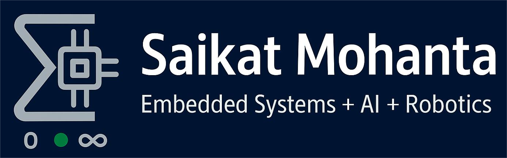

------------------------------------------------------------------------------------------------------------------------------------------------------------------------------------------------
<!-- Profile Banner -->

  

<h1 align="center">👋 Hi, It's Me Saikat Mohanta, you may call me **SaI**</h1>
<h3 align="center">🚀 Embedded Systems & AI Developer | Robotics Mentor | Electronics Engineer</h3>

------------------------------------------------------------------------------------------------------------------------------------------------------------------------------------------------

## 🌟 About Myself  

I specialize in **bridging hardware and intelligence** — development

⚡ **Embedded Systems** | 🌐 **IoT Devices** | 🤖 **Robotics Solutions** | 🧠 **Custom AI/ML Models**  

With **5+ years of hands-on experience**, I help innovators, startups, and educators bring their ideas to life — from **concept → prototype → deployment**.  

🎓 Electronics Engineer | 👨‍🏫 Robotics Mentor | 🌍 Freelancer on **Upwork, Fiverr, Workana**  

💡 *Currently focused on combining Embedded Systems + AI for smart devices, IoT, and automation.*  

------------------------------------------------------------------------------------------------------------------------------------------------------------------------------------------------

## 🛠️ Skills & Tools  

### 🔹 Hardware & Embedded Systems  
  
  
  
  
  
  

### 🔹 Programming & AI/ML  
  
  
  
  
  

### 🔹 Tools & Others  
  
  
  
  
  

------------------------------------------------------------------------------------------------------------------------------------------------------------------------------------------------

## 📌 Featured Projects  

- 🔧 **[2D-3D Laser CNC Engraver Machine](https://github.com/SaikatMohanta)**  
  *Designed & developed a CNC engraver machine up to 80W, with custom firmware and GRBL integration.*  

- 🏠 **[Home Automation System (WiFi + IR Remote)](https://github.com/SaikatMohanta)**  
  *Smart home automation devices, sold locally. Integrated IR + WiFi for appliance control.*  

- 🤖 **[Robotics Projects (Arduino-based)](https://github.com/SaikatMohanta)**  
  *Line follower, edge avoider, Bluetooth/WiFi controlled robots, autonomous navigation systems.*  

- 📷 **[ESP32-CAM IoT Surveillance](https://github.com/SaikatMohanta)**  
  *ESP32-CAM project with remote monitoring, image processing, and AI-based extensions.*  

- 🧠 **[Custom AI Transformers](https://github.com/SaikatMohanta)**  
  *Experimenting with encoder-decoder architectures, attention masking, and Q-K-V implementations for LLMs.*  

------------------------------------------------------------------------------------------------------------------------------------------------------------------------------------------------

## 📊 GitHub Stats  

  
  

------------------------------------------------------------------------------------------------------------------------------------------------------------------------------------------------

## 📜 Certifications & Highlights  
 
- ✅ AI/ML specialization with **PyTorch & TensorFlow**  
- ✅ Robotics mentor with **school & STEM lab teaching experience**  
- ✅ Built **commercial IoT devices** (home automation, AI edge devices)  
- ✅ Worked as **R&D Design Engineer**
------------------------------------------------------------------------------------------------------------------------------------------------------------------------------------------------

## 🌍 My Online Presence  

  

  

📹 [**YouTube Channel**](https://www.youtube.com/@cosmikodes) 
💼 [**Upwork**](https://www.upwork.com/) | [**Fiverr**](https://www.fiverr.com/) | [**Workana**](https://www.workana.com/)  
🐙 [**GitHub**](https://github.com/SaikatMohanta)  
✉️ **saikatmohantabkp@gmail.com**  

------------------------------------------------------------------------------------------------------------------------------------------------------------------------------------------------

## 🤝 Let’s Collaborate  

💡 If you're looking for:  
- An **embedded systems engineer** who understands **AI/ML**  
- A **mentor** for robotics, physics, or AI  
- A **freelancer** who can handle **both code & hardware**  

👉 Let’s connect and build something impactful together!  

------------------------------------------------------------------------------------------------------------------------------------------------------------------------------------------------

  

------------------------------------------------------------------------------------------------------------------------------------------------------------------------------------------------
⭐ *If you like my work, consider following me — it motivates me to share more projects and tutorials!*  
------------------------------------------------------------------------------------------------------------------------------------------------------------------------------------------------
